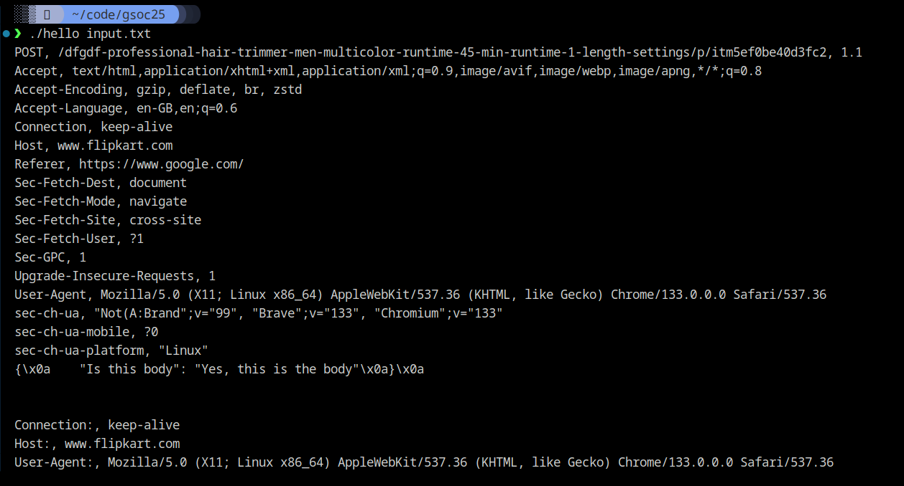

# Sample HTTP parser using spicy
This is a sample http parser using spicy. It has been connected to a c++ based host.
`hello.spicy`: The spicy script
`input.txt`: The input file containing the request.
`hello-host.cc`: Host for the spicy script.
`hello`: Compiled c++ binary which can parse the requests asintended.
`hello.h`: Header file for use by the host.

## Requirements

- `Spicy` and it's dependencies.
- `c++`

## Steps to implement
- Write spicy parser code for HTTP requests - `hello.spicy`

- Test it's working using:
`spicy-driver hello.spicy -f input.txt`
Expected output is the parsed request.

- Generate c++ code from the spicy script.
`spicyc -x hello hello.spicy`

- Generate header file using:
`spicyc -P hello hello.spicy -o hello.h`

- Write host code, importing the header file - `hello-host.cc`

- Build an executable binary from the host code:
`clang++ -o hello hello-host.cc hello___linker__.cc hello_MyHTTP.cc $(spicy-config --cxxflags --ldflags)`

- Run the binary and use the text file as the input:
`./hello input.txt`

This gives us the desired parser in executable format which is very fast.
